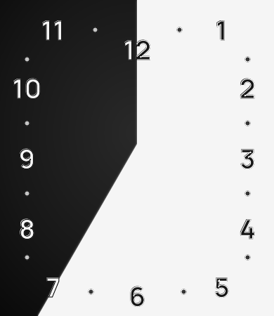

# Bip Six Progress



**Time, made visible.**

Bip Six Progress is a graphic watch face for the Amazfit Bip 6 that turns the passing day into a quiet, continuous composition. A soft white sweep begins at 12 and advances clockwise around the dial. The passing of time is visible at a glance—no hands, no clutter, just progress.

## The idea

The face starts in deep charcoal and fills with white as the 12-hour dial advances. Its large Manrope numerals are anchored to the straight edges of the display rather than arranged in a conventional circle, giving the Bip 6 screen a deliberately architectural feel.

Every element is designed to remain readable while the sweep moves underneath it:

- Hour numerals switch from white to black as the progress reaches them.
- A one-pixel inverse outline keeps each numeral crisp at the boundary between light and dark.
- Twelve half-hour dots, set at 80% opacity, make the passage of time more precise without adding noise.
- A feathered leading edge makes the progress feel calm and continuous instead of abrupt.

At each 12 o'clock position, the dial reaches a clean all-white completion before beginning its next cycle.

## Designed for Bip 6

- Native 390 × 450 layout with the face, bezel and numerals carefully positioned for the Bip 6 display.
- Manrope Bold typography rasterized locally for consistent Zepp OS rendering.
- 145 pre-rendered progress states—one every five minutes—so the visual sweep moves beyond each half-hour marker at the right moment.
- A dedicated app icon that shows the complete watch face without cropping its numerals.

## Build from source

Install the dependencies, generate the visual states and build the Zepp package:

```sh
npm ci
npm run generate:clock-face
npm run build
```

The finished `.zab` package is written to `dist/`. The Manrope font source and its SIL Open Font License are stored in `design/fonts/`.

## License

Copyright (C) 2026 Miguel Ferreira. Licensed under [GNU GPL v3.0 only](LICENSE).
